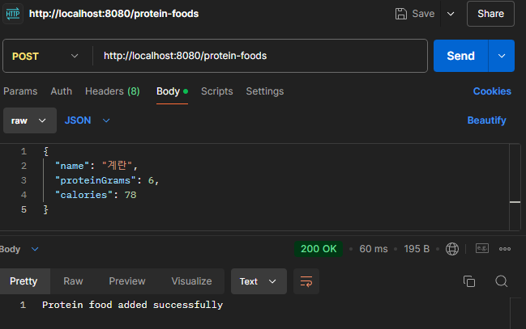
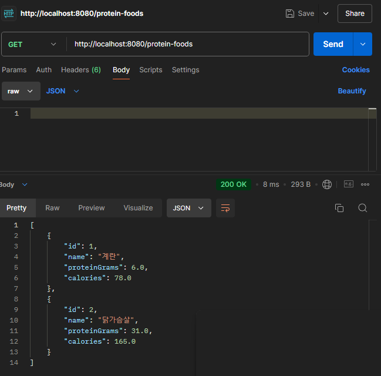
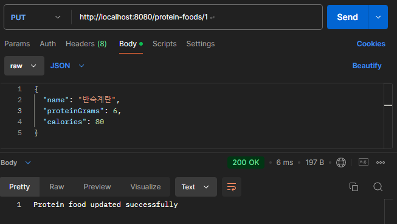
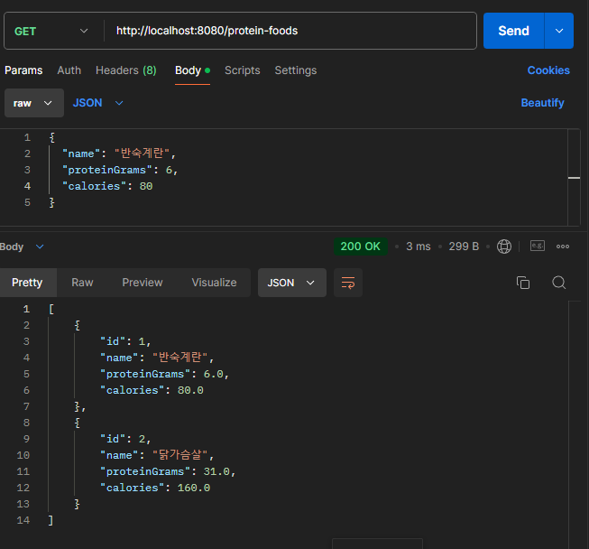
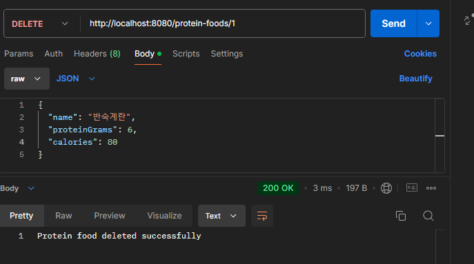

# Protein Food CRUD API

## 설명
뭐할지.. 고민하다가 각 음식의 담백질 그램수를 관리하는 간단한 CRUD입니다!

---

## Features - Tested with Postman

### 1. (POST) 음식 주가
**URL**: `http://localhost:8080/protein-foods`

- Method: `POST`
- 예시 (JSON):
```json
{
  "name": "계란",
  "proteinGrams": 6,
  "calories": 78
}
```
- 실행결과:


---

---

### 2. (GET) 저장되어있는 음식을 한눈에 보기:
- Method: `GET`
- 실행결과:


### 3. (PUT) ID 별 내용 수정
**URL**: `http://localhost:8080/protein-foods/{id}`
- Method: `PUT`
- 예시 (JSON):
```json
{
  "name": "반숙계란",
  "proteinGrams": 6,
  "calories": 80
}
```
- 실행결과:


- GET After PUT:
  

---

### 4. (DELETE) ID 별 음식 삭제하기
**URL**: `http://localhost:8080/protein-foods/{id}`
- Method: `DELETE`
- 실행결과:


---
