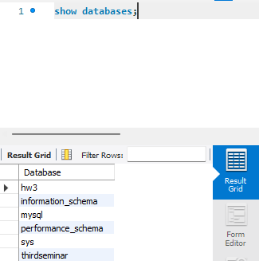
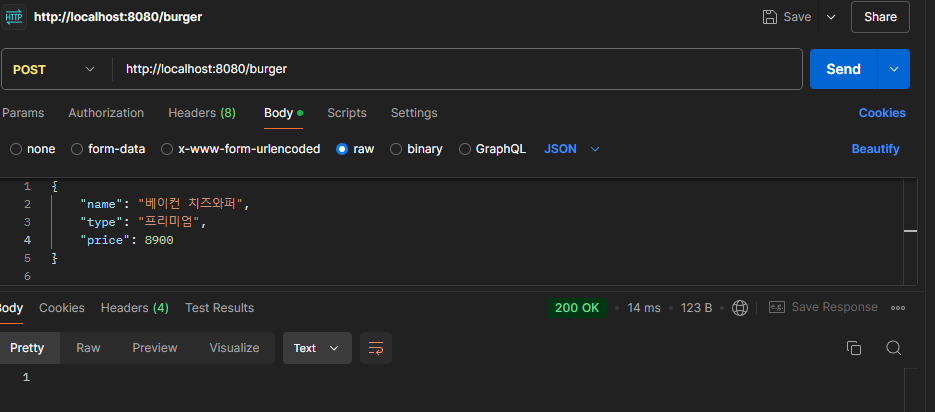
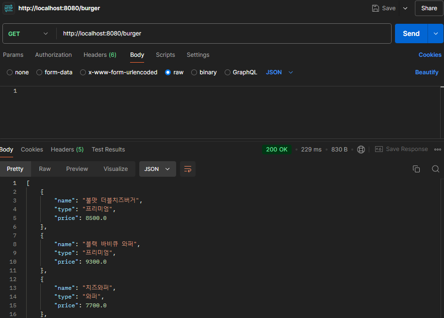
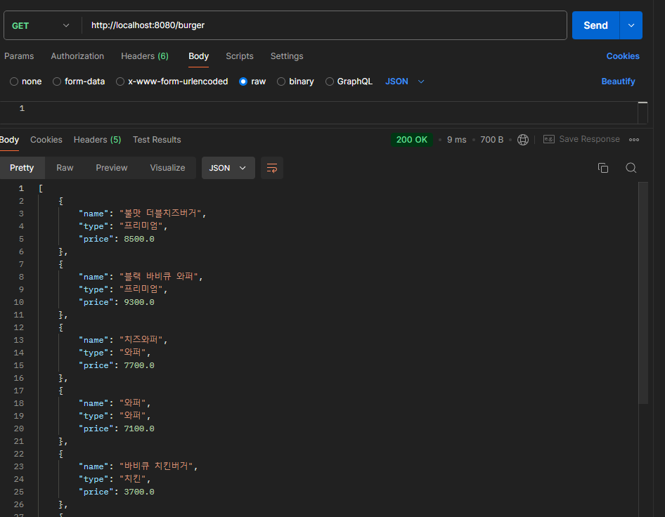
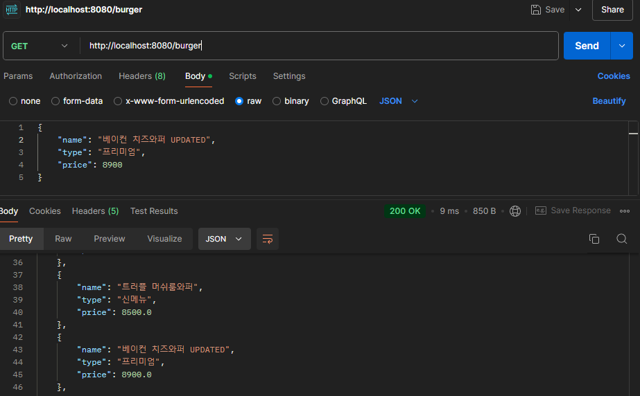
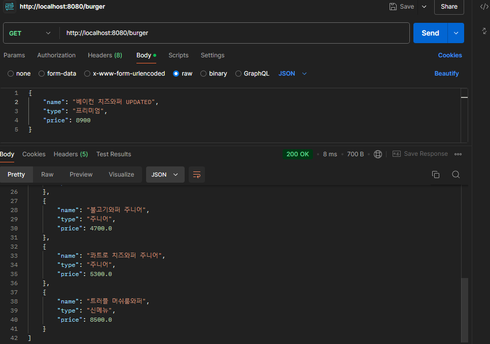
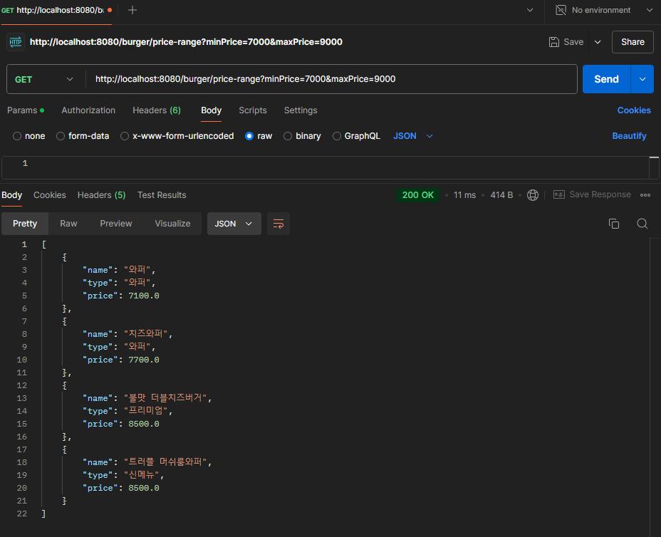
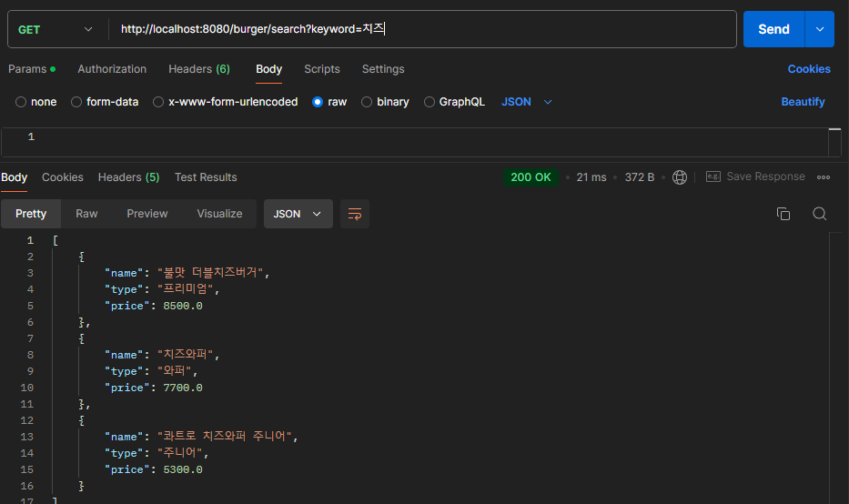
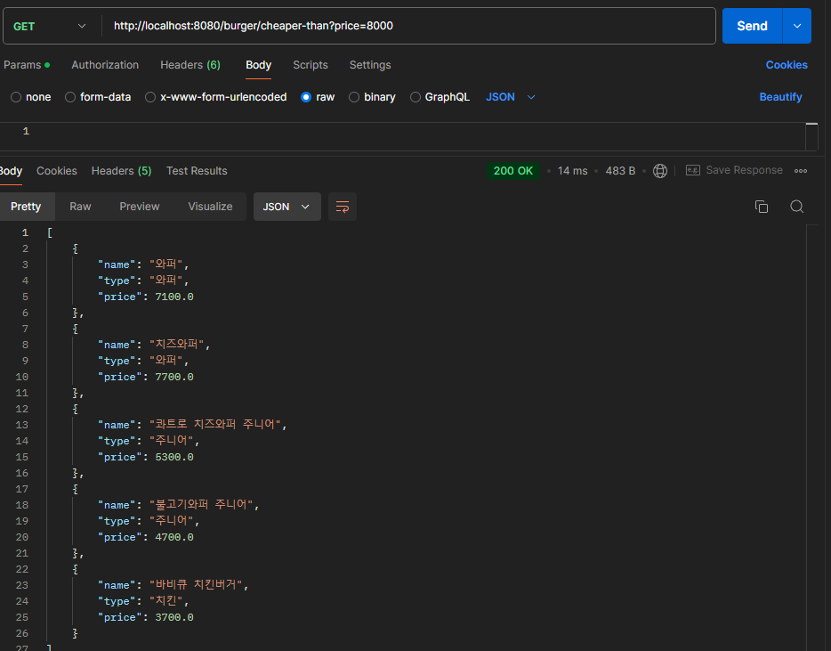

# 버거킹 단품메뉴 CRUD... 🧐

킹거킹 menu CRUD . 다이어트 중이니까 탄단지를 위해 단품. 만 취급한다는 마인드.


---

## CRUD Features ⭐

### **시작전에..!** MySQL Workbench 사용해서 db 만들기
- application.properties 에 연결시키는거 까먹지 말기

```sql
CREATE DATABASE hw3
```
데이타베이스 추가된거 확인! 



---

### 1. (POST) 버거 메뉴에 추가하기

- Method: `POST`
- 예시 (JSON):

```json
{
    "name": "베이컨 치즈와퍼",
    "type": "프리미엄",
    "price": 8900
}
```
- 실행결과:
  

### 2. (GET) 단품 버거 리스트 보기

**URL**: `http://localhost:8080/burger`

- Method: `GET`

- 실행결과:
  

---

### 2. (GET) 저장되어있는 햄버거들 한눈에 보기:

- Method: `GET`
- 실행결과:
  

### 3. (PATCH) 메뉴 업데이트

**URL**: `http://localhost:8080/burger`

- Method: `PATCH`
- 예시 (JSON):

```json
{
    "name": "베이컨 치즈와퍼 UPDATED",
    "type": "프리미엄",
    "price": 8900
}
```

- GET After PUT:
  

---

### 4. (DELETE) id 별 햄버거 삭제하기

**URL**: `http://localhost:8080/burger/{burgerId}`

- Method: `DELETE`
- 실행결과:
- GET After Delete: ( ** Updated 지웠음 )
  

---

## My JPA queries ⭐

JPA queries 를 직접 만들어서 해보기... !

### 1. (GET) 가격 range 에 따른 햄버거들 보이게 하기. 물론 가장 저려미부터

**URL**: `http://localhost:8080/burger/price-range?minPrice=7000&maxPrice=9000`




### 2. (GET) 키워드로 검색하기. 물론 ㄱㄴㄷ 순으로 

**URL**: `http://localhost:8080/burger/price-range?minPrice=7000&maxPrice=9000`



### 3. (GET) 돈 없는 나를 위해 ## 금액보다 저렴한 햄버거 검색하기 + 하지만 트랜드는 포기 못하니가 recent 위주로 보여주기

**URL**: `http://localhost:8080/burger/cheaper-than?price=9.0`


