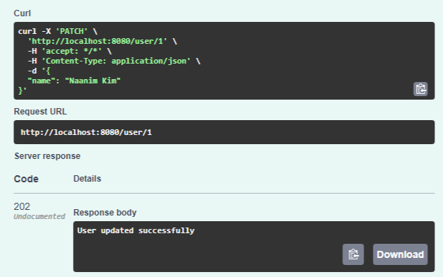
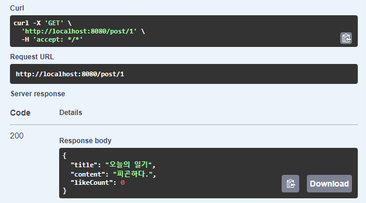
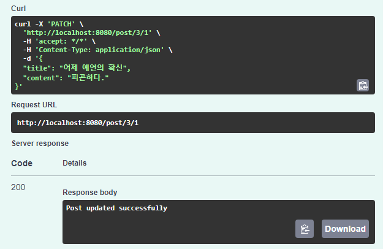
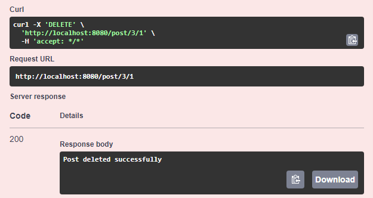

# Basic Blog Platform API
This app is a simple CRUD (Create, Read, Update, Delete) platform that allows users to manage blog posts. 


## Features:

1. **[User Management](#1-user-feature-testing)**
  - **Create User**: Add new users to the platform.
  - **Retrieve User Details**: Get user information by ID, including posts created by the user.
  - **Update User Information**: Edit user details, such as name.
  - **Delete User**: Remove a user and their associated data from the platform.

2. **[Post Management](#2-post-feature-testing)**
  - **Create Post**: Allow users to create new posts.
  - **Retrieve All Posts**: View all posts on the platform.
  - **Retrieve Post by ID**: Access details of a specific post by ID.
  - **Update Post**: Edit post content if the user is the original author.
  - **Delete Post**: Remove a post if the user is the author.

3. **[Like Toggle Feature](#3-like-feature-testing)**
  - **Toggle Like**: Users can like or unlike a post.
  - **Retrieve Like Count**: See the total number of likes for each post

### Test appliation using Swagger
- http://localhost:8080/swagger-ui/index.html#/

---

## 1. **User Feature Testing**

### Create a User

<table>
<tr>
<td>

- **Endpoint**: `POST /user`
- **Try it out json**:
 
     ```json 
     {
       "name": "Naim Kim"
     }
     ```
  - **Results 👉👉👉**

</td>
<td>

<div style="overflow-x: auto; height: 400px; width: 100%">

</div>

</td>
</tr>
</table>

---

<table>
<tr>
<td>

#### b. **Retrieve User Details by ID**

- **Endpoint**: `GET /user/{userId}`
- **Try it out**.
  - Execute with a valid `userId`.
- **Results 👉👉👉**

</td>
<td>

<div style="overflow-x: auto; height: 400px; width: 100%">

</div>

</td>
</tr>
</table>

---

<table>
<tr>
<td>

#### c. **Update User Information**

- **Endpoint**: `PATCH /user/{userId}`
- **Try it out json**.
     ```json
     {
       "name": "Naanim Kim"
     }
     ```
  - **Results 👉👉👉**

</td>
<td>

<div style="overflow-x: auto; height: 400px; width: 100%">

</div>

</td>
</tr>
</table>


---

## 2. **Post Feature Testing**

### Post Endpoints
<table>
<tr>
<td>

#### a. **Create a Post**

- **Endpoint**: `POST /post/{userId}`
- **Try it out json**.
     ```json
     {
       "title": "오늘의 일기",
       "content": "피곤하다."
     }
     ```
  - **Results 👉👉👉**

</td>
<td>

<div style="overflow-x: auto; height: 400px; width: 100%">

</div>

</td>
</tr>
</table>

---

<table>
<tr>
<td>

#### b. **Retrieve All Posts**

- **Endpoint**: `GET /post`
- **Results 👉👉👉**

</td>
<td>

<div style="overflow-x: auto; height: 400px; width: 100%">

</div>

</td>
</tr>
</table>

---

<table>
<tr>
<td>

#### c. **Retrieve Post by ID**

- **Endpoint**: `GET /post/{postId}`
- **Execute**.
- **Results 👉👉👉**

</td>
<td>

<div style="overflow-x: auto; height: 400px; width: 100%">

</div>

</td>
</tr>
</table>

---

<table>
<tr>
<td>

#### d. **Update a Post**

- **Endpoint**: `PATCH /post/{postId}/{userId}`
- **Try it out json**.
     ```json
     {
       "title": "어제 예언의 확신",
       "content": "피곤하다."
     }
     ```
- **Results 👉👉👉**

</td>
<td>

<div style="overflow-x: auto; height: 400px; width: 100%">

</div>

</td>
</tr>
</table>

---

<table>
<tr>
<td>

#### e. **Delete a Post**

- **Endpoint**: `DELETE /post/{postId}/{userId}`
- Select wnated post and Execute.
- **Results 👉👉👉**

</td>
<td>

<div style="overflow-x: auto; height: 400px; width: 100%">

</div>

</td>
</tr>
</table>

---

## 3. **Like Feature Testing**

### Like Endpoints

<table>
<tr>
<td>

#### a. **Toggle Like on a Post**

- **Endpoint**: `POST /like/{postId}/{userId}`
- Enter postId and userId to toggle like
  - **Results 👉👉👉**

</td>
<td>

<div style="overflow-x: auto; height: 400px; width: 100%">


다시 "누른다면"

</div>
</td>
</tr>
</table>

---