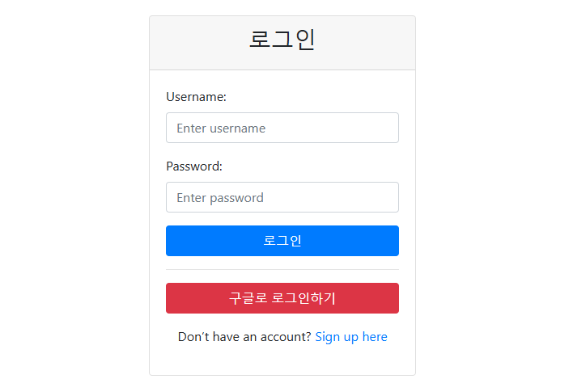
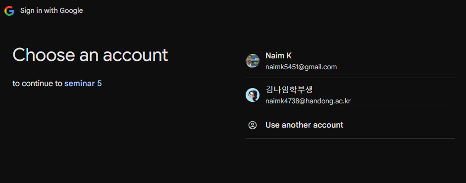
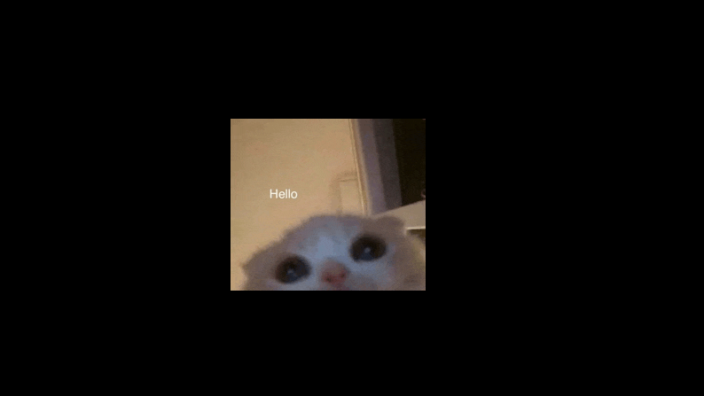
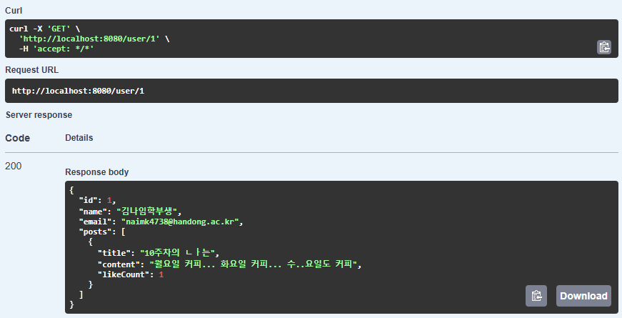

# 💻 Basic Blog Platform API ( 이전 프로젝트에 이어..)
유저 블로그 관리하는 간단한 앱!! 이전 프로젝트에 이어서 유저를 구글로그인으로 관리를 추가하였습니다 다른 기능확인은 hw4 README.md 참고

---

## **구글로그인 사용해서 유저 추가하기!**

- 앱을 실행하면 로이인 화면창이 뜬다. (html.. 은 GTP형이 만들어줬어용)
  

---

- 구글로그인 누르면 이 화면이 뜨면 성공! ( 세미나 5 때 만든 GCP 쓰기.. ㅎ)  

---

- 로그인이 성공적으로 됐다면 /home 으로 direct!  (냥이 나오면 성공적)
  

---

- Swagger 통해서 유저 잘 저장 됐는지 확인하기!!
  

---

++ 추가적으로 findmyemail 하나 추가해서 User 중볻안되도록 설정함
